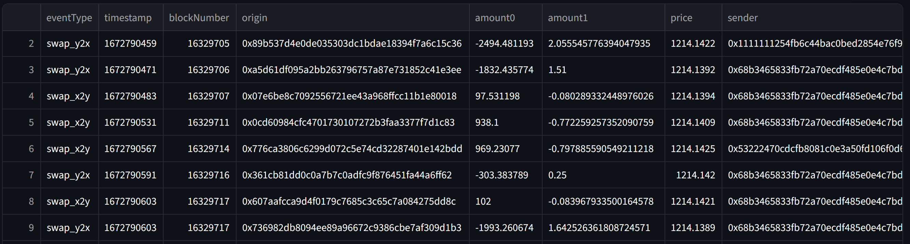
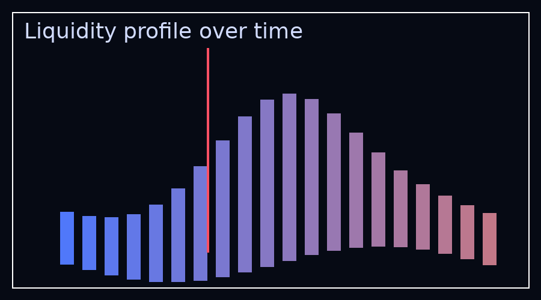

# Uniswap v3 Data Downloader





## Highlights
- **Guided runs:** Streamlit UI wires up configs for you (subgraph URL, multi-RPC list, pool preset/custom address, time window, column selection, destination folder).
- **Resilient harvesting:** Subgraph-first collector chunks, checkpoints, enriches with pool state/price, and only hits RPC when it must (receipts, fallback liquidity, optional gas stats).
- **Liquidity profiles:** Event-aware snapshotter captures historical ticks, builds big-int-safe profiles, and exports GIFs so you can eyeball liquidity shifts in seconds.
- **Neat artifacts:** Every run bundles configs, logs, raw chunks, merged pickles, manifests, and GIFs under a slugged folder so experiments stay reproducible.

## Quick start

1. **Streamlit data fetcher**
   ```bash
   streamlit run streamlit_app.py
   ```
   - Enter your Uniswap v3 subgraph endpoint plus one or more HTTPS JSON-RPC URLs.
   - Pick a pool (preset or custom address), choose the UTC window, and select the columns you need (gas columns toggle receipt lookups).
   - Hit “Start download” to stream logs and collect artifacts under `downloads/<pool+window_slug>/`.

2. **Liquidity profile animator**
   ```bash
   python -m univ3_fetcher.core.liquidity.animator
   # or python scripts/liquidity_animator.py
   ```
   - Edit `univ3_fetcher/config/default_configs/liquidity_config.yml` (or set `LIQUIDITY_CONFIG_PATH`) with your pool, time range, sampling cadence, and endpoints.
   - The script resolves blocks, fetches tick snapshots, then renders an animated GIF under `runs/pool_<addr_prefix>/`.

## Prerequisites & expectations
- Python **3.11** (the `eth_defi` dependency is 3.11-only today). Use `venv`, Conda, or pyenv to pin it.
- Bring your own **Uniswap v3 subgraph URL** (hosted service or Gateway) and **HTTPS JSON-RPC endpoints** (multiple URLs = better resiliency).
- Ethereum **mainnet only** right now.
- Runtime guidance: a single-day window with swaps-only columns typically finishes in 5–10 minutes; selecting gas metadata or multi-month windows can stretch to an hour+. Liquidity GIFs reuse cached manifests/tick files after the first run, but the first full build may take several minutes depending on snapshot count.

---

## Features
- Streamlit configurator covering subgraph endpoint, multiple HTTPS RPC URLs, pool presets/custom pools, time windows, destination paths, and advanced performance knobs.
- Subgraph-first event harvester with resilience features: automatic chunking, resumable checkpoints, retry/backoff for receipts, and derived price plus before/after pool state fields.
- Real-time log streaming in the app plus organized run artifacts (configs, logs, raw chunk pickles, merged output, metadata JSON).
- Selective gas and transaction metadata retrieval—receipts are only fetched when you opt into gas columns.
- Standalone liquidity profile animator (`liquidity.py`) that turns historical tick snapshots into GIFs with progress bars and resume support.

## Requirements
- Python 3.11.x (the on-chain dependency `web3-ethereum-defi` — imported as `eth_defi` — does not yet publish wheels for 3.12+).
- Recommended: virtual environment (venv, Conda, etc.).
- Install dependencies from `requirements.txt`.

### Installation

You can set up the environment using either `venv` or Conda:

<details>
<summary><strong>Using venv</strong></summary>

```bash
git clone https://github.com/DanieleMDiNosse/Univ3_fetcher.git
cd Univ3_fetcher
python3.11 -m venv .venv  # ensure Python 3.11 is available (pyenv works too)
source .venv/bin/activate
python -m pip install --upgrade pip
pip install -r requirements.txt
```
</details>

<details>
<summary><strong>Using Conda</strong></summary>

```bash
git clone https://github.com/DanieleMDiNosse/Univ3_fetcher.git
cd Univ3_fetcher
conda create -n univ3_fetcher python=3.11
conda activate univ3_fetcher
pip install --upgrade pip
pip install -r requirements.txt
```
</details>

## Running the Streamlit App
1. Activate your environment and start Streamlit:
   ```bash
   streamlit run streamlit_app.py
   ```
2. Provide the Uniswap v3 subgraph endpoint (The Graph hosted service or your Gateway URL).
3. Enter one or more HTTPS JSON-RPC URLs. Multiple endpoints improve reliability because the fetcher uses `web3-ethereum-defi`'s multi-provider client.
4. Pick a pool preset or input a custom pool address. Presets automatically surface known Uniswap v3 pools and token metadata.
5. Choose the UTC start/end date and time. The app validates that the end time is after the start time.
6. Select the columns to keep in the merged dataset. Selecting any gas column enables transaction receipt lookups (slower but richer data).
7. Set a destination folder; each run creates a unique slugged subdirectory with config, logs, outputs, and metadata.
8. Fine-tune advanced parameters if needed:
   - **Chunk size (blocks)** / **parallel workers**: legacy RPC fetcher controls that remain useful when falling back to on-chain logs.
   - **Batch size for metadata RPC**: how many receipts/origins are fetched per batch.
   - **Subgraph page size** and **chunk events**: tune how many events are requested and buffered per GraphQL query.
9. Click **Start download**. The UI streams the harvesting logs, shows progress, and surfaces any errors.

After a successful run, the final directory (inside `downloads/` by default) contains:
- `config/data_fetch_config.yml`: exact parameters used.
- `logs/data_fetch.log`: full stdout from `data_fetch_subgraph.py`.
- `outputs/chunks/<pool>/`: raw chunk pickles emitted by the harvester.
- `outputs/merged/<pool>.pkl`: filtered dataset matching your column choices.
- `metadata.json`: summary metadata (pool label, time range, row counts, artifact paths).

## CLI Harvesters

### `data_fetch_subgraph.py` (default)
The Streamlit app invokes this script under the hood, and you can call it directly if you prefer automation:

```bash
python data_fetch_subgraph.py
```

By default it reads `data_fetch_config.yml`; override the path with `DATA_FETCH_CONFIG_PATH`. Key config fields include `graph_url`, `json_rpc_urls`, `pool_addr`, `start_ts`, `end_ts`, `subgraph_page_size`, `chunk_events`, `batch_receipt_size`, `checkpoint_path`, `out_dir`, `skip_gas_data`, and `compute_price_column`. The harvester checkpoints progress and can be restarted safely with the same config.

### `data_fetch.py` (legacy RPC-only)
The original RPC-first pipeline remains available for environments where the subgraph cannot be reached. It shares most configuration keys with the subgraph variant but relies on `chunk_size_blocks`/`parallel_workers` instead of `subgraph_page_size`/`chunk_events`.

```bash
python data_fetch.py
```

## Liquidity Profile Animator
- `liquidity.py` consumes `liquidity_config.yml` (override with `LIQUIDITY_CONFIG_PATH`) to build an animated GIF of the pool's liquidity over time.
- The config supports both subgraph-powered runs (`use_subgraph: true`) and offline CSV replays. Required keys include `pool_id`, `start_ts`, `end_ts`, `step_seconds`, pagination limits, and output paths.
- Run it with:

```bash
python liquidity.py
```

- Each execution writes checkpoints, intermediate CSV/parquet artifacts, and the final GIF under `runs/<timestamped_folder>/`.

## Tips
- RPC nodes may rate limit large requests. Supplying multiple URLs and modest chunk sizes improves reliability.
- Balance `subgraph_page_size` and `chunk_events` to fit your memory budget while keeping API calls efficient.
- Gas columns (`gasUsed`, `gasPrice`, `effectiveGasPrice`) require transaction receipts, which significantly i ncrease runtime—only enable them when needed.
- Re-run failed harvests with the same config to resume from the latest checkpoint instead of starting over.
- The combined pickle saved under `data/<pool>.pkl` (if present) is reused to speed up repeated runs; clear it if you want a fresh aggregation.
- For the liquidity animator, start with a narrower time range to validate your config before rendering long animations.

Happy data fetching!
